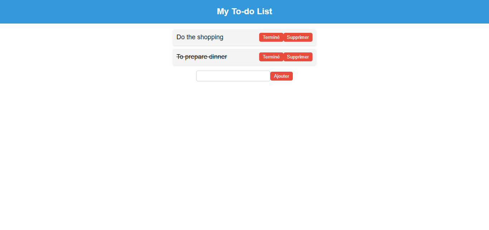

# React ToDo List App

This is a basic ToDo List application built using React. It allows users to add new tasks, mark tasks as completed, and delete tasks.

## Demo



## Table of Contents

- [Demo](#Demo)
- [Getting Started](#getting-started)
- [Features](#features)
- [Folder Structure](#folder-structure)
- [Usage](#usage)
- [Contributing](#contributing)

## Getting Started

To run this application locally, follow these steps:

1. Clone this repository:

   ```bash
   git clone https://github.com/your-username/react-todo-list.git
   ```

2. Navigate to the project directory:

   ```bash
   cd react-todo-list
   ```

3. Install dependencies:

   ```bash
   npm install
   ```

4. Run the application:

   ```bash
   npm start
   ```

   This will start the development server. Open [http://localhost:3000](http://localhost:3000) in your browser to view the app.

## Features

- Add new tasks to the ToDo list.
- Mark tasks as completed.
- Delete tasks from the ToDo list.

## Folder Structure

The project structure is organized as follows:

- `src/`: Contains the source code.
  - `App.js`: Main component that manages state and renders the application.
  - `TodoList.js`: Component for rendering the ToDo list and handling task operations.
  - `TodoItem.js`: Component for rendering individual ToDo items.
- `index.js`: Entry point of the application.
- `App.css`: Stylesheet for the application.
- `index.css`: Global styles.

## Usage

- The ToDo list is displayed on the main page.
- To add a new task, type the task in the input field and click the "Ajouter" button.
- Click the "Terminé" button to mark a task as completed.
- Click the "Supprimer" button to delete a task.

## Contributing

Contributions are welcome! Feel free to open issues or submit pull requests.